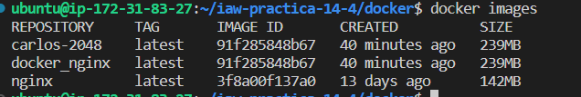

# iaw-practica-14-4
Practica 14-4

Para esta practica vamos a querer crear el juego 2048 mediante docker.
Para esto vamos a necesitar tener un archivo de dockerfile y un docker-compose.yml

Vamos a necesitar previamente tener instalado docker y docker-compose
```
sudo apt install docker.io
sudo apt install docker-compose
```
Vamos a empezar a explicar el dockerfile.


Como vemos esto tiene una estructura muy basica.
Simplemente seleccionamos la imagen, actualizamos el sistema e instalamos git.
Hacemos una clonacion del repositorio del Jose Juan y lo guardamos en tmp/2048 y copiamos su contenido en /usr/share/nginx/html.
Ahora indicamos el puerto por donde va a salir y indicamos el comando que se ejecuta al crear el contenedor de nginx.

Ahora vamos a mirar el archivo docker-compose.yml:


Simplemente nos creamosel servicio de nginx, seleccionamos el archivo anterior y seleccionamos el puerto por el que va a salir.

Para poder ejecutar el dockerfile:
```
docker-compose up -d
```

Para comprobar que funciona vamos a usar el comando:
```
docker images
```
Como vemos nos muestra todas las imagenes creadas:



Para comprobar que nos funciona:


