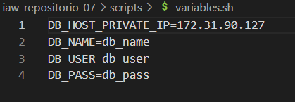
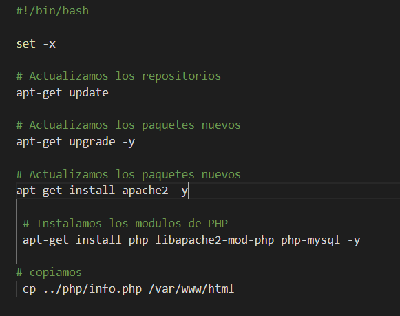
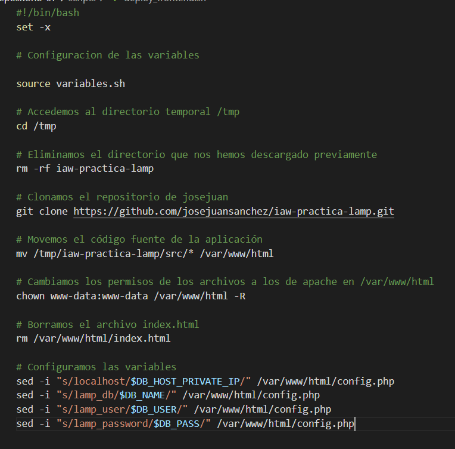
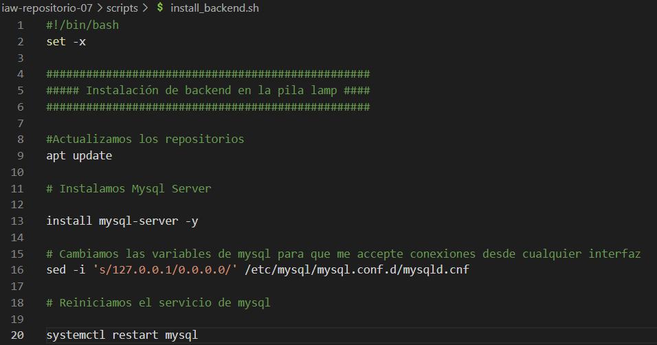
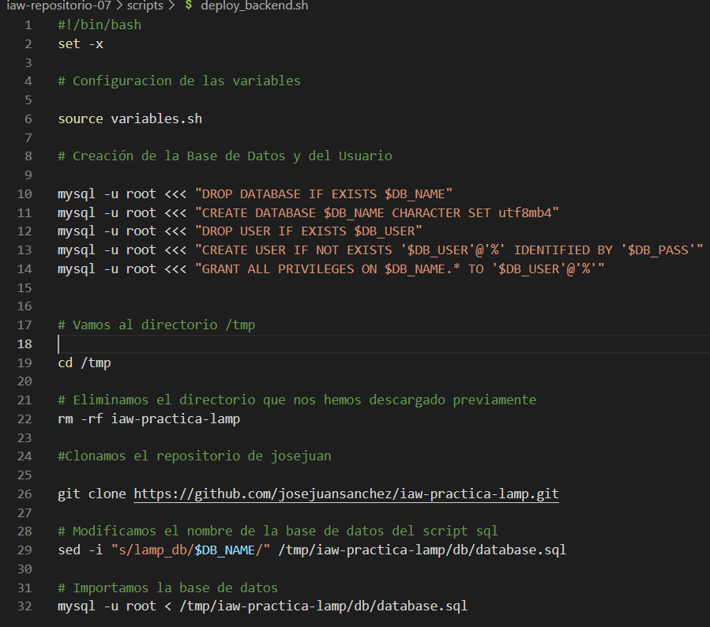
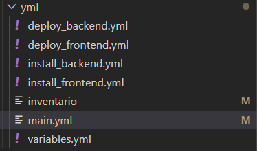
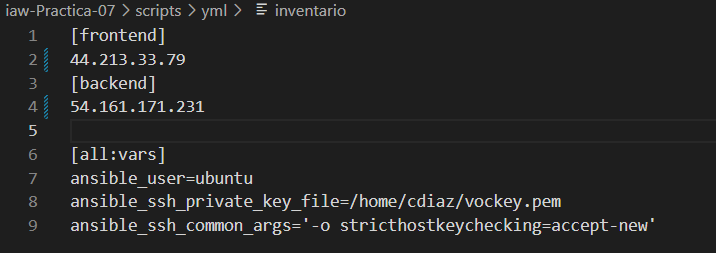
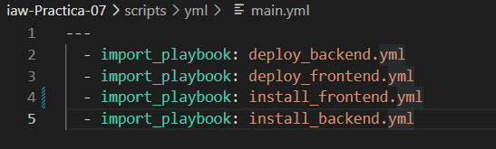
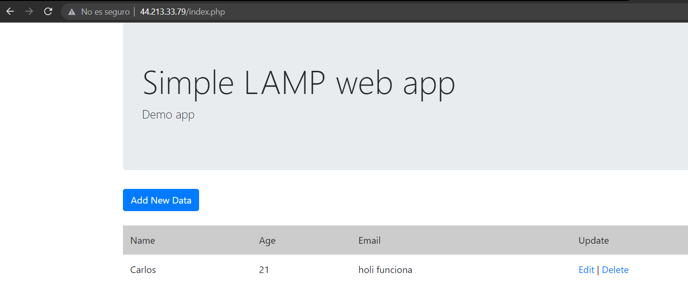
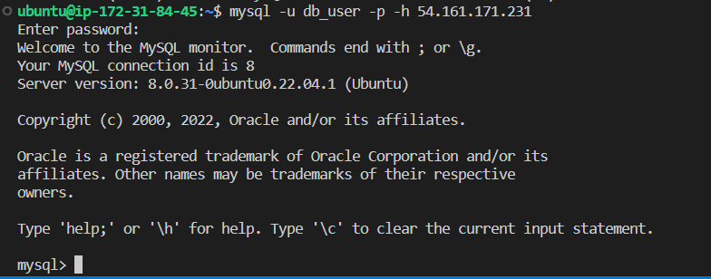

# iaw-Practica-07
practica7

Para poder realizar esta practica vamos a necesitar un total de 3 máquinas, en mi caso una maquina llamada frontend, otra backend y por último mi maquina Open Suse de wsl.
Para entender que vamos a realizar en esta actividad, vamos a configurar la maquina Open Suse para que esta sea capaz de ejecutar todos los comandos que necesitamos en las máquinas de un solo script.
Después vamos a tener en la maquina fronted los script para crear el servidor Apache.
Por último, vamos a tener en la máquina backend los scripts para crear el servidor MYSQL.

Bien, ahora explicado esto vamos a irnos a la maquina frontend. En esta maquina vamos a tener 3 archivos, el install, el deploy y un archivo con las variables:
Las variables que vamos a usar son:

El install del front es instalar apache y sus módulos PHP:

En el deploy_frontend movemos el condigo fuente cambiamos permisos y configuramos las variables:

En la máquina del backend tenemos los mismos archivos.
En el install_backend tenemos la instalación de mysql server: 

En el deploy_backend tenemos la creación de la base de datos y su usuario y la importación de la base de datos:

(Las variables son las mismas)
Ahora nos falta la maquina WSL OpenSuse(en mi caso).
En esta máquina vamos a tener un total de:

La función de los deploys, installs y variables es la misma pero escrito en yml.
En el inventario es donde vamos a poner la ip publica de nuestras dos maquinas y donde vamos a mostrar donde esta nuestra clave privada(vockey.pem):

En la main.yml es donde vamos a tener la ejecución de todos los yml anteriores ejecutando solo ese:

Con el comando import_playbook: (nombre del archivo) se empezaran a ejecutar todos los yml.
Para confirmar que funciona podemos hacerlo de dos maneras:
1 Poniendo en nuestro navegador la ip de nuestra maquina front

2 Poniendo en nuestra maquina front el comando mysql -u db_user -p -h (54.161.171.231) y nos debería de dejar conectarnos al mysql de la mauqina backend.

