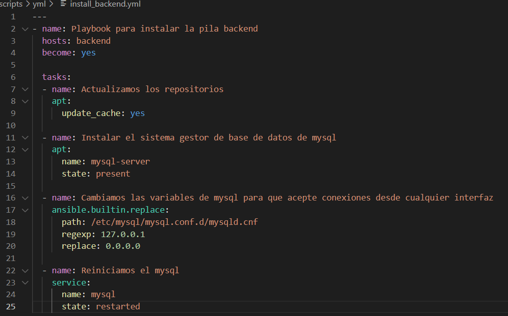
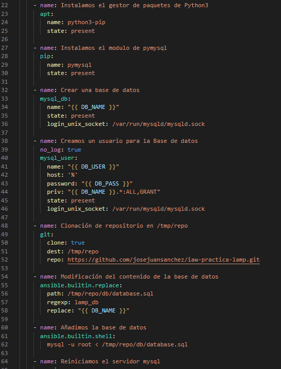
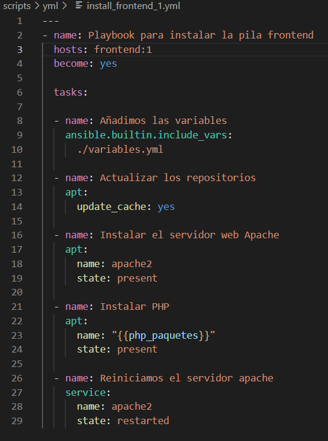
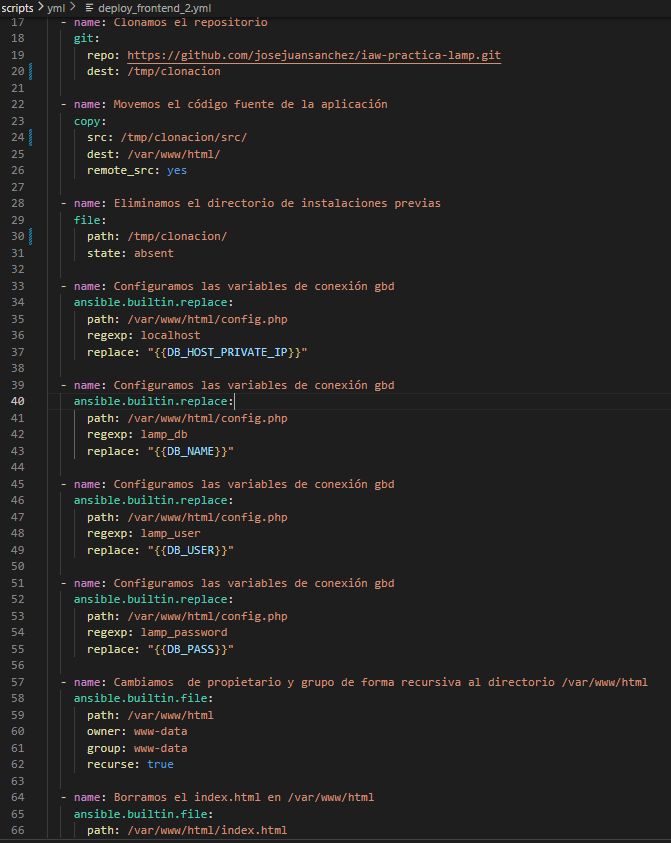
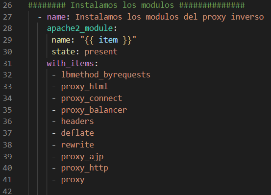
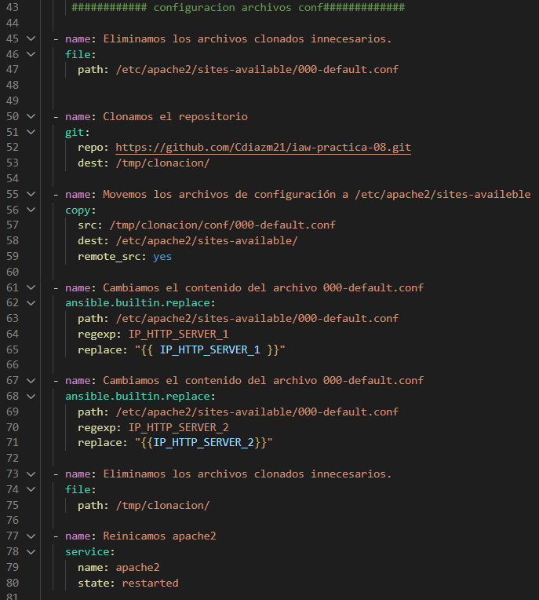
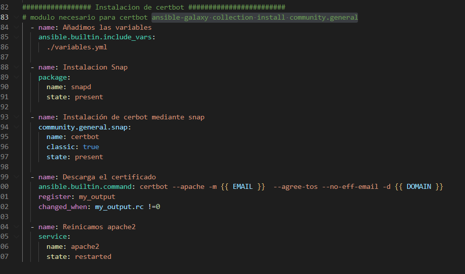
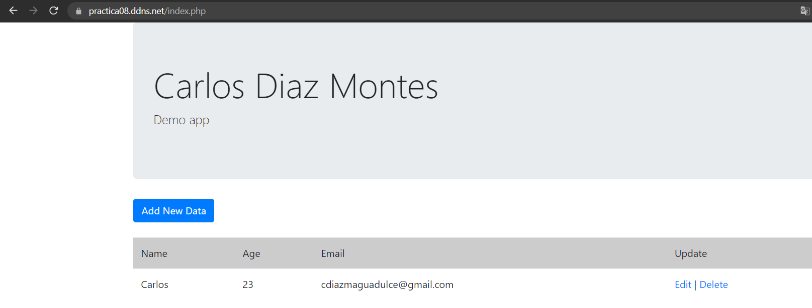
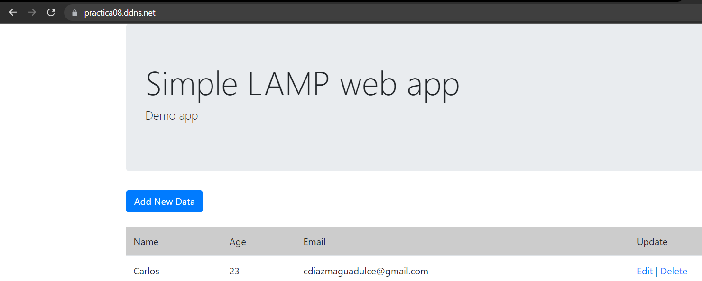

# iaw-practica-08

Para esta practica vamos a necesitar un total de 4 máquinas. Una maquina Backend donde vamos a tener instalado MYSQL.
Despues dos máquinas frontend donde vamos a instalar Apache.
Por ultimo vamos a tener una maquina balanceador donde vamos a tener instalado apache y vamos a instalarnos un proxy inverso.

Ahora vamos a ver como seria la instalacion en yml de la maquina backend donde tendremos MYSQL.
El install_backend tenemos que instalar MYSQL:

El deploy_backend realizamos la instalacion de los modulos y la creacion de la base de datos:

Ahora voy a explicar el frontend, como en los dos frontend vamos a tener lo mismo lo voy a explicar una vez.
Lo primero que vamos a hacer es realizar la instalacion del servidor Apache2:

Ahora vamos a irnos al deploy_Frontend donde vamos a configurar las variables de la base de datos:

Ahora para la maquina que va a hacer de balanceador, vamos a usar el mismo install que el frontend, osea que instalamos el apache lo primero.
Ahora vmaos a hacer el balanceador, para eso vamos a usar el proxy inverso. Para esto primero nos vamos a instalar los modulos necesarios(en mi caso he puesto un bucle):

Ahora vamos a configurar los archivos conf:

Ahora vamos a instalar certbor, para instalar certbot he tenido que usar el comando **ansible-galaxy collection install community.general**
Instalamos snap y despues instalamos certbot y ejecutamos el certificado:

Comprobamos que nos funciona, para esto tenemos que buscar en el navegador primero nuestro dominio, como vemos nos sale nuestro index.php. 

Ahora modifico un index.php de algun frontend, y si refrescamos la pagina podemos ver como con el mismo dominio puedo usar dos frontend distintos:

